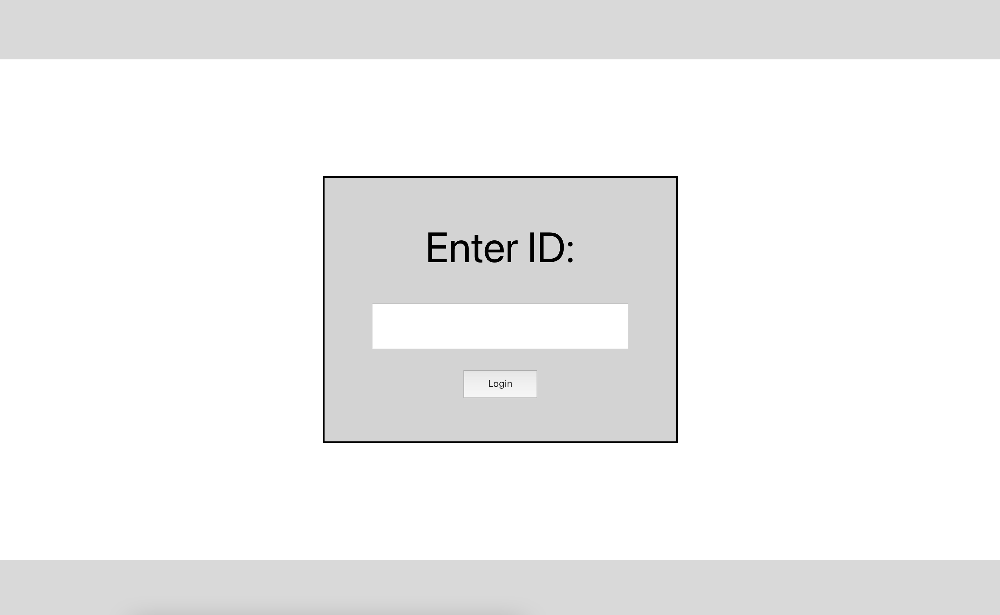
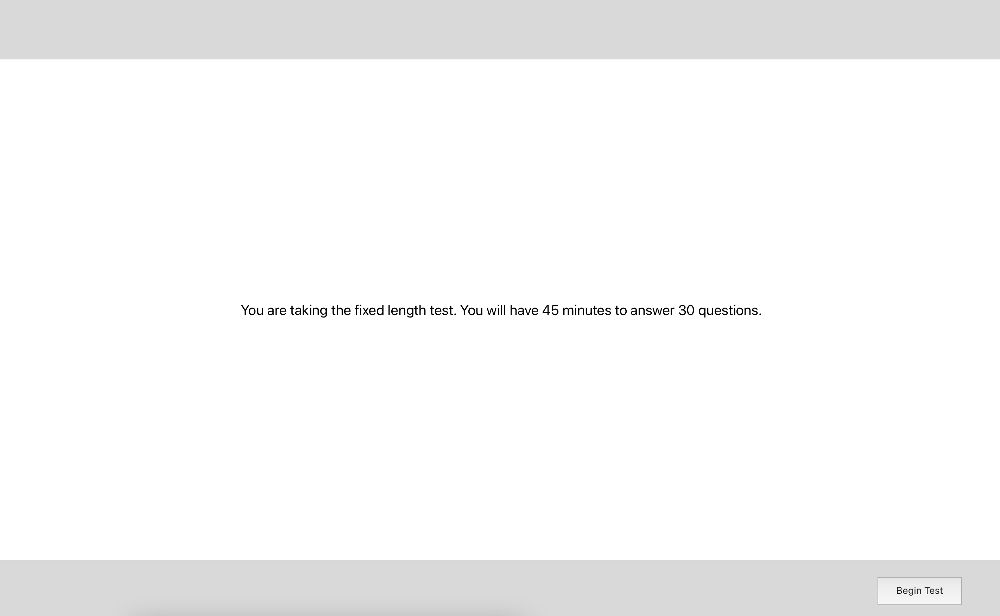
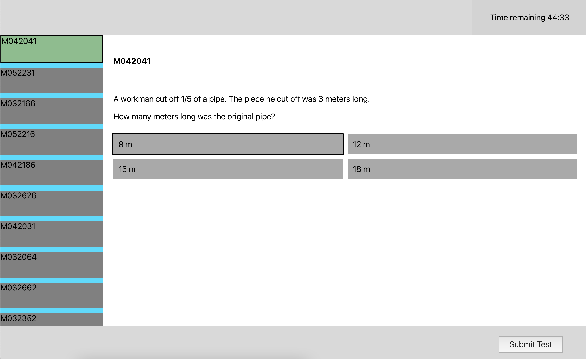
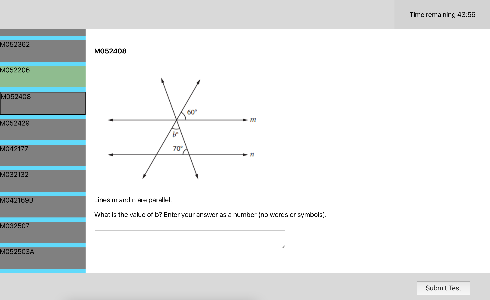
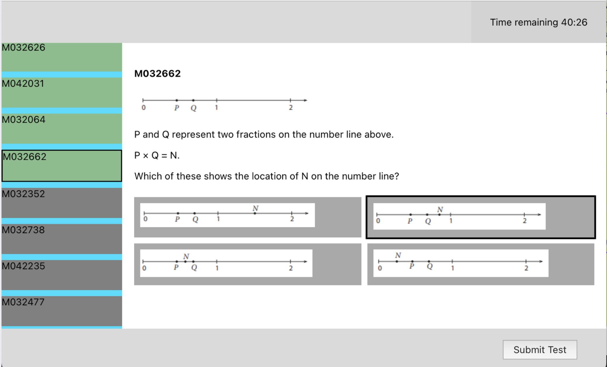
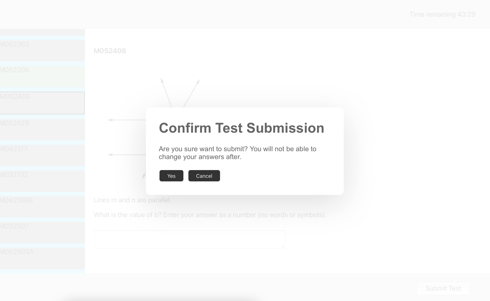

# Project 52: Computer Adaptive Testing in Educational Assessment

Computer adaptive testing (CAT) is a form of testing which uses algorithms to adjust its difficulty based on the ability of the user with the aim of providing more precise ability measurements. This project focuses on a form of CAT known as multistage testing (MST) and aims to compare the effectiveness of MST against traditional fixed length tests by implementing an online testing platform supporting both testing paradigms. The R package, mstR, is used to implement the features of the multistage test (e.g. ability estimation and module selection) which is integrated with the backend via RCaller.

The backend is created in Spring Boot can be found in [`src/main/java/com/p4p/cat`](src/main/java/com/p4p/cat). 

The frontend uses React and can be found in [`src/main/js`](src/main/js).

The questions used to create the tests are from the Trends in International Mathematics and Science Study (TIMSS) 2011 Grade 8 mathematics assessment and can be found in [`src/main/scripts/all.json`](src/main/scripts/all.json).

## Research Documents
For more information about the project design, development, and testing process, view the [`doc`](doc) folder which contains all the relevant material.

## Project Setup
1. Install R
2. Install the mstR package by entering ```install.packages("mstR")``` in the R console
3. Install the Gradle dependencies specified in the build.gradle file
4. Install frontend dependencies by running npm install in src/main/js

Note: The application uses MongoDB therefore you should set up an application.properties file in src\main\resources with a line specifying the database URI i.e. ```spring.data.mongodb.uri=YOUR_MONGODB_URI```

## Build Process
1. Build the frontend using ```npm run build```
2. Move frontend build files to the backend static folder (`src/main/resources`)
3. Build the backend into a jar using ```gradle build```

## Deployment
The application is deployed on an AWS EC2 instance setup with Java, R and mstR. The database is hosted remotely using MongoDB Atlas Cluster.


# Features

## Brief Overview of Features
1. Administers both fixed length test (FL) and multistage test (MST)
2. FL has 30 questions, 45 minutes.
3. Our MST design is 2 stages. 
4. MST first stage has one testlet, whose result determines the testlet in stage 2
5. MST second stage has 3 testlets - easy, medium, difficult
6. All MST testlets have 10 questions, 15 minutes
7. We use MR2JS(MongoDB, React, R, Java, Spring Boot) stack. You can pronounce it as 'Mr 2 Js'
8. It has crash/reload recovery, so your progress or login status won't be lost
9. Made without UI frameworks, so the UI design is quite simple and barebone

## Screenshots

### Login Screen
This is the login screen. The users created using `POST /users` will have id to access the application. 
The other routes cannot be accessed before logging in.



### Information Screen
This is the information screen, that is used to instruct the user which test they are sitting
(either MST or FL tests) or inform the user that the test has ended.



### Test Screen
Test screen shows timer, questions list, question, and a submit button. When the timer runs out, the test is
automatically submitted. The answered questions are indicated as green on the left, and the selected answer
is shown with black border. 



The platform supports multiple choice questions (as shown above) and short answer questions (as shown below). Both types support
images and text for the question content, and multiple choice questions can have both images and text too.




Finally, when the user submits the test, they are given a confirmation dialog informing that they cannot revisit 
the questions once they submit. When they confirm, the user responses are submitted to `POST /mst` (if MST test) or `POST /fl` (if FL test).
The user can submit before answering all the questions.



## Backend API Endpoints
We only briefly describe the available endpoints here.
For the required payloads and request/response data types, refer to the backend codes and [API and DB Schema.docx](./doc/Development/API%20and%20DB%20schema.docx)
### Users
The following endpoints manage CRUD operations on Users

| Endpoint | Description | 
|---|---|
| `POST /users` | Create specified number of users. Test order (Multistage Test first or Fixed Length Test first) is randomly assigned. |
| `DELETE /users` | Delete all users from the database. |
| `GET /user/{id}` | Get user document of the user id {id}] |  

### Questions
The following endpoints manage CRUD operations on Users

| Endpoint | Description | 
|---|---|
| `POST /questions` | Create questions using json payload |
| `GET /questions/{id}` | Get question document of question of {id} |
| `GET /questions` | Get documents of all the questions in the database |
| `DELETE /questions` | Delete all the questions |

### Multistage Adaptive Test (MST-CAT) 

| Endpoint | Description |
|---|---|
| `GET /mst/{moduleId}` | Get questions of the MST module of {id} |
| `POST /mst` | Submit user responses for an MST stage. Updates user score and assigns next module |

### Fixed Length Test 

| Endpoint | Description | 
|---|---|
| `GET /fixed` | Get questions of the fixed length test |
| `POST /fixed` | Submit user responses for the fixed length test. Updates user score. |